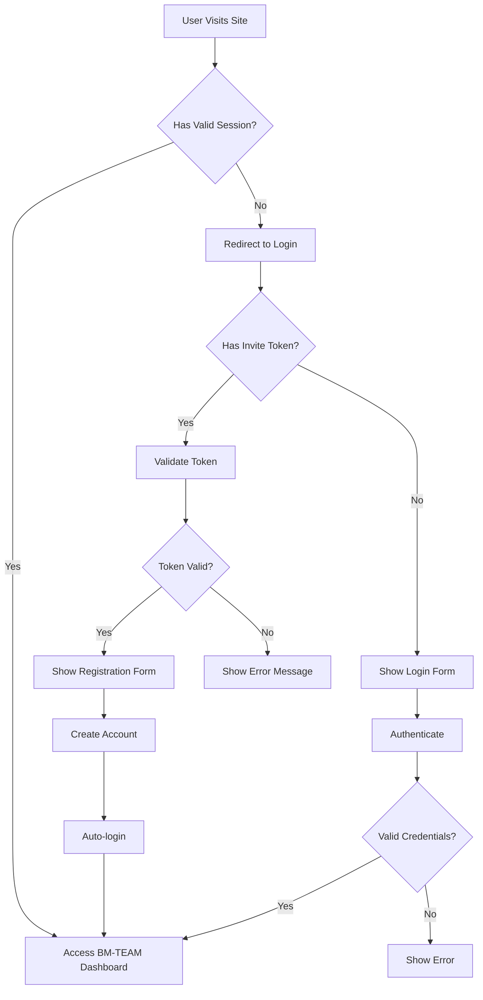

# BM-TEAM Organization Authentication System - Product Requirements Document

## 1. Product Overview

An invitation-only organization authentication system that transforms the existing NUTRIA MACRO application into a private, team-based platform. Only organization owners can create accounts and issue invite links, ensuring controlled access to enhanced team features.

The system addresses the need for secure, organization-level access control while maintaining the existing nutrition planning functionality with additional collaborative features for authenticated team members.

## 2. Core Features

### 2.1 User Roles

| Role   | Registration Method                   | Core Permissions                                                              |
| ------ | ------------------------------------- | ----------------------------------------------------------------------------- |
| Owner  | Initial seeding (3 master accounts)   | Full admin access, create/manage users, generate invites, access all features |
| Member | Invite-only via Owner-generated token | Access team features, view shared content, use enhanced functionality         |
| Guest  | No access                             | Cannot access the application                                                 |

### 2.2 Feature Module

Our organization authentication system consists of the following main pages:

1. **Login Page**: invite token validation, secure authentication, role-based redirection
2. **BM-TEAM Dashboard**: enhanced version of main page with team features, shared meal plans, collaboration tools
3. **Admin Panel**: user management, invite generation, organization settings (Owner only)
4. **Profile Page**: user settings, role display, organization membership details
5. **Main Application**: existing nutrition planning features with team enhancements

### 2.3 Page Details

| Page Name         | Module Name             | Feature Description                                                                                            |
| ----------------- | ----------------------- | -------------------------------------------------------------------------------------------------------------- |
| Login Page        | Authentication Form     | Validate email/password with invite token, display role-specific welcome messages, redirect based on user role |
| Login Page        | Invite Token Validation | Real-time token validation, display invite details (role, organization), handle expired/invalid tokens         |
| BM-TEAM Dashboard | Enhanced Meal Builder   | Team meal templates, shared nutrition goals, collaborative meal planning with real-time updates                |
| BM-TEAM Dashboard | Team Analytics          | Organization-wide nutrition statistics, team progress tracking, comparative analysis                           |
| BM-TEAM Dashboard | Collaboration Tools     | Shared meal plans, team challenges, nutrition coaching features, comment system                                |
| Admin Panel       | User Management         | List organization members, view user roles, deactivate/reactivate accounts, role modification                  |
| Admin Panel       | Invite Generation       | Create single-use invite tokens, set expiration times, specify roles, track invite status                      |
| Admin Panel       | Organization Settings   | Configure team preferences, set default nutrition goals, manage feature flags                                  |
| Profile Page      | User Information        | Display current role, organization membership, account creation date, last login                               |
| Profile Page      | Settings Management     | Update personal information, change password, notification preferences                                         |
| Main Application  | Feature Flags           | Enable/disable enhanced features based on authentication status, role-based feature access                     |
| Main Application  | Session Management      | Automatic token refresh, secure logout, session timeout handling                                               |

## 3. Core Process

### Owner Flow

1. Owner logs in with credentials (seeded master accounts)
2. Accesses Admin Panel to generate invite tokens
3. Shares invite links with potential team members
4. Manages organization users and settings
5. Accesses all BM-TEAM enhanced features

### Member Flow

1. Receives invite link from Owner
2. Validates invite token and creates account
3. Logs in and accesses BM-TEAM dashboard
4. Uses enhanced team features and collaboration tools
5. Manages personal profile and settings

### Authentication Flow

## 4. User Interface Design

### 4.1 Design Style

* **Primary Colors**: Dark theme (#0f1115 background, #1a1f2e cards)

* **Secondary Colors**: Green accent (#22c55e for CTAs), Blue highlights (#3b82f6)

* **Button Style**: Rounded corners (8px), subtle shadows, hover animations

* **Typography**: Inter font family, 14px base size, clear hierarchy

* **Layout Style**: Card-based design, responsive grid, sticky navigation

* **Icons**: Lucide React icons, 18px standard size, consistent stroke width

### 4.2 Page Design Overview

| Page Name         | Module Name         | UI Elements                                                                                           |
| ----------------- | ------------------- | ----------------------------------------------------------------------------------------------------- |
| Login Page        | Authentication Form | Centered card layout, gradient background, floating labels, animated submit button with loading state |
| Login Page        | Invite Validation   | Success/error badges, token details display, progress indicators, clear call-to-action buttons        |
| BM-TEAM Dashboard | Enhanced Header     | Organization logo, user avatar dropdown, role badge, quick actions toolbar                            |
| BM-TEAM Dashboard | Team Features       | Tabbed interface, real-time notifications, collaborative editing indicators, shared content cards     |
| Admin Panel       | User Management     | Data table with sorting/filtering, action buttons, modal dialogs, bulk operations                     |
| Admin Panel       | Invite Generation   | Form with validation, token preview, expiration settings, copy-to-clipboard functionality             |
| Profile Page      | User Info Display   | Avatar upload, role badges, organization details, activity timeline                                   |
| Main Application  | Feature Flags       | Conditional rendering, enhanced UI elements, team-specific navigation items                           |

### 4.3 Responsiveness

Desktop-first design with mobile-adaptive breakpoints. Touch interaction optimization for mobile invite sharing and team collaboration features. Responsive navigation with hamburger menu on mobile devices.

## 5. Security Requirements

### 5.1 Authentication Security

* JWT-based session management with automatic refresh

* Secure password requirements (minimum 8 characters, alphanumeric)

* Rate limiting on login attempts (5 attempts per 15 minutes)

* Session timeout after 4 hours of inactivity

### 5.2 Invite Token Security

* Single-use tokens with 24-hour expiration

* Cryptographically secure token generation

* Hashed token storage (SHA-256)

* Email validation before token generation

* Rate limiting on invite generation (10 per hour per owner)

### 5.3 Data Protection

* Row-level security (RLS) for all database operations

* Role-based access control for all endpoints

* HTTPS enforcement for all communications

* Secure cookie configuration with SameSite protection

## 6. Technical Constraints

### 6.1 Performance Requirements

* Page load time under 2 seconds

* Authentication response time under 500ms

* Real-time collaboration updates within 1 second

* Support for up to 100 concurrent users

### 6.2 Browser Compatibility

* Modern browsers (Chrome 90+, Firefox 88+, Safari 14+, Edge 90+)

* Mobile browsers (iOS Safari 14+, Chrome Mobile 90+)

* JavaScript required for full functionality

### 6.3 Integration Requirements

* Supabase authentication service

* PostgreSQL database with RLS

* Email service for invite notifications (future enhancement)

* Real-time subscriptions for team features

## 7. Success Metrics

### 7.1 User Adoption

* 100% of invited users successfully create accounts within 48 hours

* 90% of users access BM-TEAM features within first week

* Average session duration increases by 50% for authenticated users

### 7.2 Security Metrics

* Zero unauthorized access attempts succeed

* 100% of invite tokens expire or are used within 24 hours

* No security vulnerabilities in authentication flow

### 7.3 Performance Metrics

* 95% of authentication requests complete under 500ms

* 99.9% uptime for authentication services

* Zero data breaches or unauthorized data access

## 8. Future Enhancements

### 8.1 Phase 2 Features

* Email notifications for invite links

* Multi-organization support

* Advanced team analytics and reporting

* Integration with external nutrition databases

### 8.2 Phase 3 Features

* Mobile application with same authentication

* API access for third-party integrations

* Advanced role permissions (custom roles)

* Audit logging and compliance features

