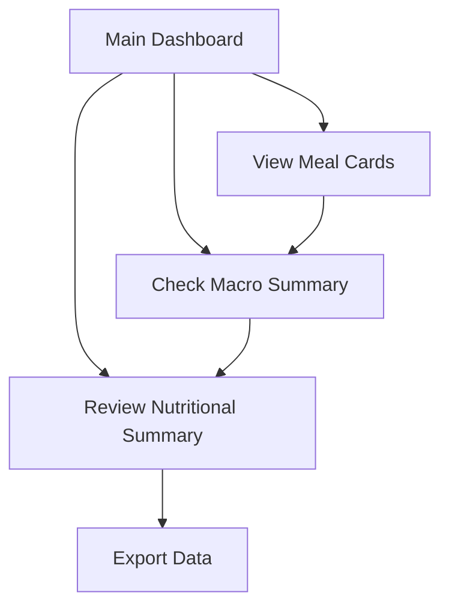

# NUTRIA MACRO - Product Requirements Document

## 1. Product Overview

NUTRIA MACRO is a modern, professional, and responsive single-page application (SPA) for nutrition planning that displays daily meal plans with detailed macronutrient summaries.

The application helps users visualize their daily nutrition intake by showing foods in each meal and providing comprehensive macro calculations, targeting health-conscious individuals and nutrition professionals who need clear meal planning visualization.

The initial version focuses on static data display to establish core functionality before expanding to user input and backend integration.

## 2. Core Features

### 2.1 User Roles

| Role | Registration Method | Core Permissions |
|------|---------------------|------------------|
| Viewer | Direct access (no registration) | Can view meal plans and macro summaries |

### 2.2 Feature Module

Our nutrition planning application consists of the following main pages:

1. **Main Dashboard**: header navigation, meal builder section, macro summary panel, nutritional summary section.

### 2.3 Page Details

| Page Name | Module Name | Feature description |
|-----------|-------------|---------------------|
| Main Dashboard | Header | Display logo, navigation links, login button with sticky positioning and backdrop blur effect |
| Main Dashboard | Meal Builder Section | Display meal cards in responsive grid layout (3 columns on large screens), show meal names and food items with macro values |
| Main Dashboard | Macro Summary Panel | Show sticky summary card with total daily calories (highlighted), protein, carbs, and fats totals |
| Main Dashboard | Meal Card | Display individual meal information with food table (name, quantity, protein, carbs, fats, calories), add food button, empty state message |
| Main Dashboard | Nutritional Summary Section | Show detailed macro distribution table by meal with totals, export functionality |

## 3. Core Process

The main user flow is straightforward viewing and analysis:

1. User accesses the application
2. Views the main dashboard with pre-loaded meal data
3. Examines individual meal cards with food items and macros
4. Reviews the sticky macro summary for daily totals
5. Analyzes detailed nutritional breakdown in the summary section
6. Can export the nutritional data

## 4. User Interface Design

### 4.1 Design Style

- **Primary Colors**: Sky blue (#0ea5e9) for highlights and primary actions
- **Secondary Colors**: Neutral grays (neutral-900, neutral-950) for dark theme
- **Background**: Dark theme with neutral-950 body and neutral-900 cards
- **Button Style**: Rounded corners with size variants (sm, md, lg) and color variants (primary sky blue, secondary neutral)
- **Font**: Sans-serif font family for clean readability
- **Layout Style**: Card-based design with sticky navigation and summary panels
- **Icons**: SVG icons for logo, plus, chart bar, download, and total indicators

### 4.2 Page Design Overview

| Page Name | Module Name | UI Elements |
|-----------|-------------|-------------|
| Main Dashboard | Header | Sticky header with backdrop-blur-sm, logo with "NUTRIA MACRO" text, navigation links, login button |
| Main Dashboard | Meal Builder | Responsive grid (lg:grid-cols-3), meal cards with rounded-xl borders, dark neutral-900 background |
| Main Dashboard | Macro Summary | Sticky positioning, large sky-blue calorie display, organized macro breakdown |
| Main Dashboard | Food Table | Clean table layout with columns for food details and macro values, empty state messaging |
| Main Dashboard | Summary Section | Distinct neutral-900 background, detailed table with thead/tbody/tfoot structure, export button |

### 4.3 Responsiveness

The application is desktop-first with mobile-adaptive design. The grid layout adjusts from 3 columns on large screens to single column on mobile devices. Touch interaction is optimized for mobile users with appropriate button sizing and spacing.