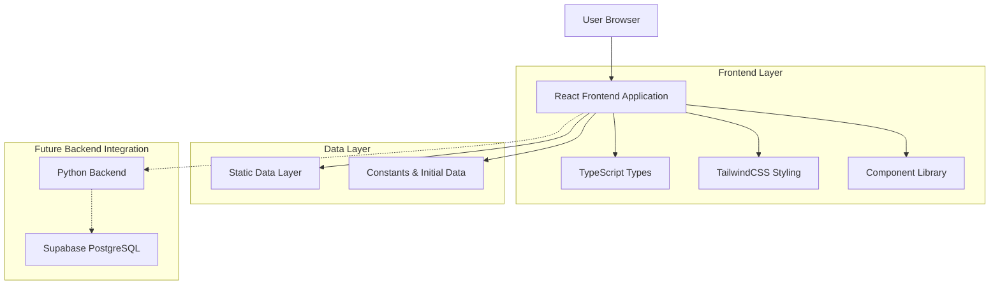
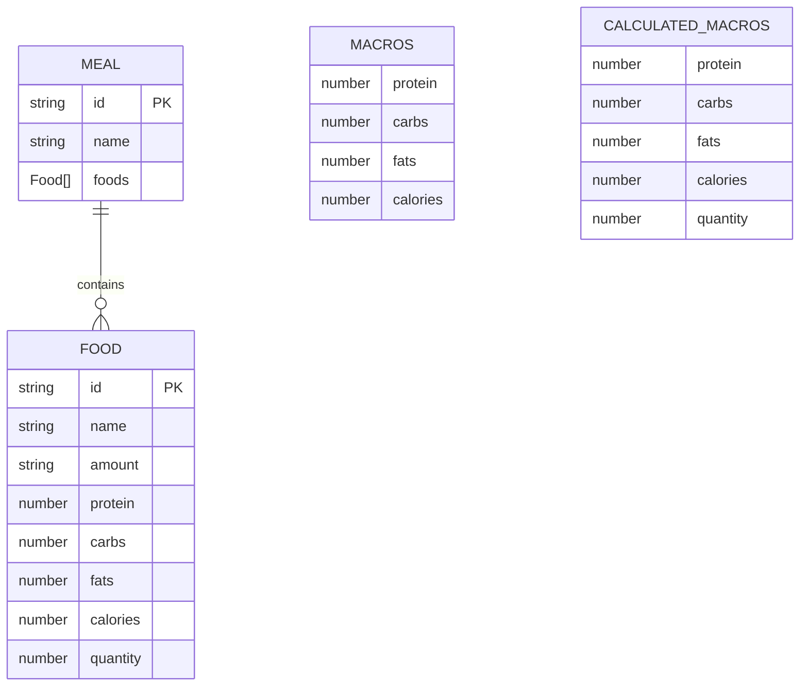

# NUTRIA MACRO - Technical Architecture Document

## 1. Architecture Design



## 2. Technology Description

* Frontend: React\@19 + TypeScript + TailwindCSS + Vite (ES6 modules with importmap)

* Backend: None (static data initially, Python + Supabase planned for future)

* Styling: TailwindCSS via CDN

* Module System: ES6 modules loaded directly in browser

## 3. Route Definitions

| Route | Purpose                                                                          |
| ----- | -------------------------------------------------------------------------------- |
| /     | Main dashboard displaying meal builder, macro summary, and nutritional breakdown |

## 4. Component Architecture

### 4.1 Component Hierarchy

```
App.tsx (Root Component)
├── Header.tsx
├── main
│   ├── MealBuilderSection.tsx
│   │   ├── MealCard.tsx (multiple instances)
│   │   └── MacrosSummary.tsx (sticky)
│   └── SummarySection.tsx
└── footer
```

### 4.2 Core Components

**UI Components (/components/ui/)**

* `Card.tsx`: Reusable card component with CardHeader, CardContent, CardFooter

* `Button.tsx`: Versatile button with variants (primary, secondary) and sizes (sm, md, lg)

* `Icons.tsx`: SVG icon components (Logo, PlusIcon, ChartBarIcon, DownloadIcon, TotalIcon)

**Feature Components**

* `Header.tsx`: Sticky navigation with logo, nav links, and login button

* `MealBuilderSection.tsx`: Main content area with responsive grid layout

* `MealCard.tsx`: Individual meal display with food table and add button

* `MacrosSummary.tsx`: Sticky summary panel with daily macro totals

* `SummarySection.tsx`: Detailed nutritional breakdown table with export functionality

## 5. Data Model

### 5.1 Data Model Definition



### 5.2 TypeScript Type Definitions

```typescript
// Core data types
export interface Food {
  id: string;
  name: string;
  amount: string;
  protein: number;
  carbs: number;
  fats: number;
  calories: number;
  quantity: number;
}

export interface Meal {
  id: string;
  name: string;
  foods: Food[];
}

export interface Macros {
  protein: number;
  carbs: number;
  fats: number;
  calories: number;
}

export interface CalculatedMacros extends Macros {
  quantity: number;
}

export interface MealWithMacros extends Meal {
  macros: CalculatedMacros;
}

export interface NavLink {
  name: string;
  href: string;
}
```

### 5.3 Initial Data Structure

```typescript
// Sample initial meals data
export const INITIAL_MEALS: Meal[] = [
  {
    id: 'breakfast',
    name: 'Café da manhã',
    foods: [
      {
        id: 'oats',
        name: 'Aveia',
        amount: '50g',
        protein: 6.5,
        carbs: 32.5,
        fats: 3.5,
        calories: 185,
        quantity: 50
      },
      // Additional breakfast foods...
    ]
  },
  {
    id: 'lunch',
    name: 'Almoço',
    foods: [
      // Lunch foods with realistic macro values...
    ]
  },
  {
    id: 'dinner',
    name: 'Jantar',
    foods: [] // Initially empty
  }
];

export const NAV_LINKS: NavLink[] = [
  { name: 'Dashboard', href: '#' },
  { name: 'Planos', href: '#' },
  { name: 'Relatórios', href: '#' }
];
```

## 6. State Management

### 6.1 Component State

* **App.tsx**: Manages meals state initialized with INITIAL\_MEALS

* **useMemo hooks**: Calculate meal macros and total daily macros

* **Props drilling**: Pass calculated data to child components

### 6.2 Calculation Logic

```typescript
// Macro calculation functions
const calculateMealMacros = (foods: Food[]): CalculatedMacros => {
  return foods.reduce((total, food) => ({
    protein: total.protein + food.protein,
    carbs: total.carbs + food.carbs,
    fats: total.fats + food.fats,
    calories: total.calories + food.calories,
    quantity: total.quantity + food.quantity
  }), { protein: 0, carbs: 0, fats: 0, calories: 0, quantity: 0 });
};
```

## 7. File Structure

```
/
├── index.html (Entry point with TailwindCSS CDN and importmap)
├── index.tsx (React app initialization)
├── App.tsx (Root component with state management)
├── metadata.json (Project metadata)
├── types.ts (TypeScript type definitions)
├── constants.ts (Initial data and constants)
└── components/
    ├── Header.tsx
    ├── MealBuilderSection.tsx
    ├── SummarySection.tsx
    ├── meal_builder/
    │   ├── MealCard.tsx
    │   └── MacrosSummary.tsx
    └── ui/
        ├── Button.tsx
        ├── Card.tsx
        └── Icons.tsx
```

## 8. Future Backend Integration

### 8.1 Planned Architecture

* **Backend**: Python with FastAPI or Flask

* **Database**: Supabase PostgreSQL

* **Authentication**: Supabase Auth

* **API**: RESTful endpoints for meal and food management

### 8.2 Migration Path

1. Replace static data with API calls
2. Add user authentication
3. Implement CRUD operations for meals and foods
4. Add user-specific meal plans
5. Integrate nutrition database APIs

