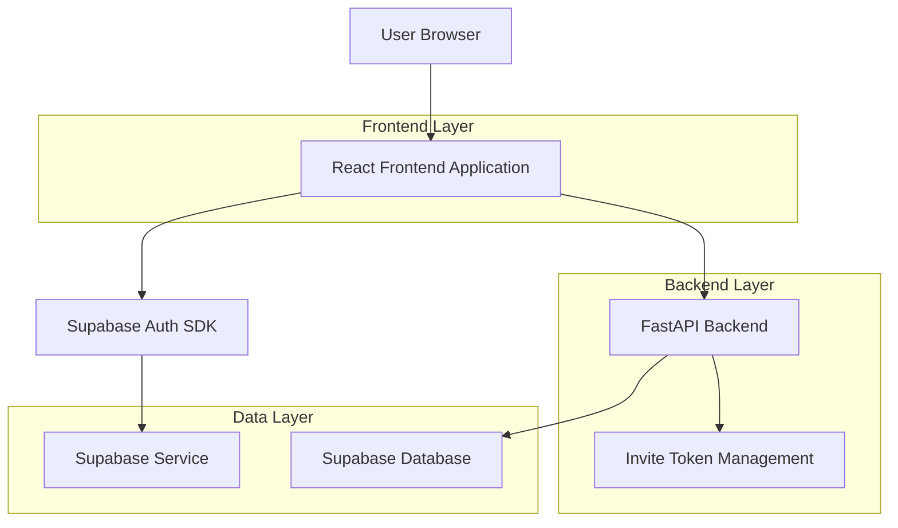
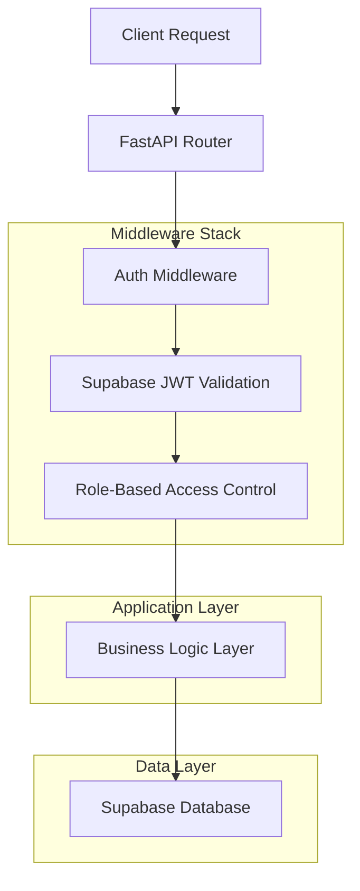
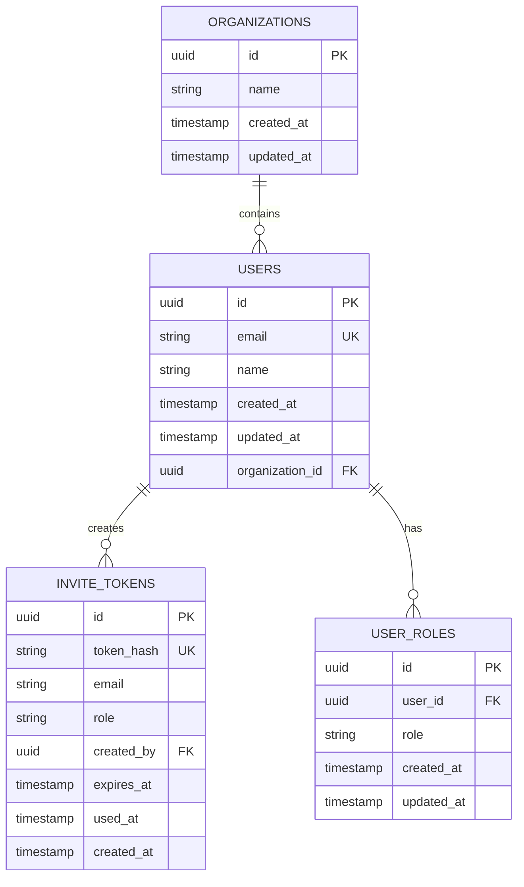

# Supabase Authentication Migration Architecture

## 1. Architecture Design



## 2. Technology Description

* Frontend: React\@18 + TypeScript + Vite + TailwindCSS

* Backend: FastAPI + Python

* Database: Supabase (PostgreSQL)

* Authentication: Supabase Auth

* Session Management: Supabase JWT tokens

* Invite System: Custom backend service with hashed tokens

## 3. Route Definitions

| Route    | Purpose                                 | Auth Required | Role Required |
| -------- | --------------------------------------- | ------------- | ------------- |
| /        | Home page, displays main content        | No            | None          |
| /login   | Login page with invite token validation | No            | None          |
| /bm-team | Hidden team page with enhanced features | Yes           | Owner/Member  |
| /profile | User profile and settings               | Yes           | Owner/Member  |
| /admin   | Admin panel for user management         | Yes           | Owner         |

## 4. API Definitions

### 4.1 Authentication APIs

**Login with invite token**

```
POST /api/auth/login-with-invite
```

Request:

| Param Name  | Param Type | isRequired | Description             |
| ----------- | ---------- | ---------- | ----------------------- |
| email       | string     | true       | User email address      |
| password    | string     | true       | User password           |
| inviteToken | string     | true       | Single-use invite token |

Response:

| Param Name | Param Type | Description               |
| ---------- | ---------- | ------------------------- |
| user       | User       | Authenticated user object |
| session    | Session    | Supabase session with JWT |

**Generate invite token (Owner only)**

```
POST /api/admin/generate-invite
```

Request:

| Param Name | Param Type | isRequired | Description                       |
| ---------- | ---------- | ---------- | --------------------------------- |
| email      | string     | true       | Email for the invite              |
| role       | string     | true       | Role: 'owner' or 'member'         |
| expiresIn  | number     | false      | Expiration in hours (default: 24) |

Response:

| Param Name  | Param Type | Description                 |
| ----------- | ---------- | --------------------------- |
| inviteToken | string     | Single-use invite token     |
| expiresAt   | string     | ISO timestamp of expiration |

**Validate invite token**

```
GET /api/auth/validate-invite/{token}
```

Response:

| Param Name | Param Type | Description                            |
| ---------- | ---------- | -------------------------------------- |
| valid      | boolean    | Whether token is valid and not expired |
| email      | string     | Email associated with invite           |
| role       | string     | Role for the invite                    |

### 4.2 User Management APIs

**List organization users (Owner only)**

```
GET /api/admin/users
```

Response:

| Param Name | Param Type | Description                 |
| ---------- | ---------- | --------------------------- |
| users      | User\[]    | Array of organization users |

**Update user role (Owner only)**

```
PATCH /api/admin/users/{userId}/role
```

Request:

| Param Name | Param Type | isRequired | Description                   |
| ---------- | ---------- | ---------- | ----------------------------- |
| role       | string     | true       | New role: 'owner' or 'member' |

## 5. Server Architecture Diagram



## 6. Data Model

### 6.1 Data Model Definition



### 6.2 Data Definition Language

**Organizations Table**

```sql
CREATE TABLE organizations (
    id UUID PRIMARY KEY DEFAULT gen_random_uuid(),
    name VARCHAR(255) NOT NULL,
    created_at TIMESTAMP WITH TIME ZONE DEFAULT NOW(),
    updated_at TIMESTAMP WITH TIME ZONE DEFAULT NOW()
);

-- Enable RLS
ALTER TABLE organizations ENABLE ROW LEVEL SECURITY;

-- Policies
CREATE POLICY "Users can view their organization" ON organizations
    FOR SELECT USING (id IN (
        SELECT organization_id FROM user_roles 
        WHERE user_id = auth.uid()
    ));
```

**User Roles Table**

```sql
CREATE TABLE user_roles (
    id UUID PRIMARY KEY DEFAULT gen_random_uuid(),
    user_id UUID REFERENCES auth.users(id) ON DELETE CASCADE,
    organization_id UUID REFERENCES organizations(id) ON DELETE CASCADE,
    role VARCHAR(20) NOT NULL CHECK (role IN ('owner', 'member')),
    created_at TIMESTAMP WITH TIME ZONE DEFAULT NOW(),
    updated_at TIMESTAMP WITH TIME ZONE DEFAULT NOW(),
    UNIQUE(user_id, organization_id)
);

-- Enable RLS
ALTER TABLE user_roles ENABLE ROW LEVEL SECURITY;

-- Policies
CREATE POLICY "Users can view their own roles" ON user_roles
    FOR SELECT USING (user_id = auth.uid());

CREATE POLICY "Owners can manage organization roles" ON user_roles
    FOR ALL USING (
        organization_id IN (
            SELECT organization_id FROM user_roles 
            WHERE user_id = auth.uid() AND role = 'owner'
        )
    );
```

**Invite Tokens Table**

```sql
CREATE TABLE invite_tokens (
    id UUID PRIMARY KEY DEFAULT gen_random_uuid(),
    token_hash VARCHAR(255) UNIQUE NOT NULL,
    email VARCHAR(255) NOT NULL,
    role VARCHAR(20) NOT NULL CHECK (role IN ('owner', 'member')),
    organization_id UUID REFERENCES organizations(id) ON DELETE CASCADE,
    created_by UUID REFERENCES auth.users(id) ON DELETE CASCADE,
    expires_at TIMESTAMP WITH TIME ZONE NOT NULL,
    used_at TIMESTAMP WITH TIME ZONE,
    created_at TIMESTAMP WITH TIME ZONE DEFAULT NOW()
);

-- Enable RLS
ALTER TABLE invite_tokens ENABLE ROW LEVEL SECURITY;

-- Policies
CREATE POLICY "Owners can manage invites" ON invite_tokens
    FOR ALL USING (
        organization_id IN (
            SELECT organization_id FROM user_roles 
            WHERE user_id = auth.uid() AND role = 'owner'
        )
    );

-- Indexes
CREATE INDEX idx_invite_tokens_hash ON invite_tokens(token_hash);
CREATE INDEX idx_invite_tokens_email ON invite_tokens(email);
CREATE INDEX idx_invite_tokens_expires ON invite_tokens(expires_at);
```

**Seed Data for Master Accounts**

```sql
-- Insert default organization
INSERT INTO organizations (id, name) 
VALUES ('00000000-0000-0000-0000-000000000001', 'BM-TEAM Organization');

-- Note: Master users will be created via Supabase Auth API
-- Their roles will be inserted after user creation:
-- INSERT INTO user_roles (user_id, organization_id, role)
-- VALUES 
--   ('{master_user_1_id}', '00000000-0000-0000-0000-000000000001', 'owner'),
--   ('{master_user_2_id}', '00000000-0000-0000-0000-000000000001', 'owner'),
--   ('{master_user_3_id}', '00000000-0000-0000-0000-000000000001', 'owner');
```

## 7. Migration Strategy

### 7.1 Phase 1: Supabase Setup

1. Create Supabase project and configure environment variables
2. Set up database schema with RLS policies
3. Configure Supabase Auth settings (email/password, invite-only)
4. Install Supabase client SDK in frontend

### 7.2 Phase 2: Backend Integration

1. Replace localStorage auth with Supabase JWT validation
2. Implement invite token generation and validation endpoints
3. Add role-based middleware for route protection
4. Migrate existing user data (if any) to Supabase

### 7.3 Phase 3: Frontend Migration

1. Replace auth utilities with Supabase client calls
2. Update login/register components for invite flow
3. Add role-based route guards
4. Implement BM-TEAM page with feature flags

### 7.4 Phase 4: Master Account Seeding

1. Create 3 master accounts via Supabase Auth API
2. Assign Owner roles in user\_roles table
3. Generate initial invite tokens for testing

## 8. Security Considerations

### 8.1 Authentication Security

* Use Supabase JWT tokens with automatic refresh

* Implement proper CORS configuration

* Enable Supabase RLS for all tables

* Hash invite tokens before storage (SHA-256)

* Set reasonable token expiration (24 hours default)

### 8.2 Authorization Security

* Implement role-based access control (RBAC)

* Validate user roles on every protected endpoint

* Use Supabase RLS policies for database-level security

* Implement proper session management

### 8.3 Invite Token Security

* Generate cryptographically secure random tokens

* Single-use tokens (mark as used after redemption)

* Time-based expiration with cleanup job

* Rate limiting on invite generation

* Email validation before token generation

## 9. Implementation Checklist

### Backend Tasks

* [ ] Install Supabase Python client

* [ ] Create database schema and RLS policies

* [ ] Implement JWT validation middleware

* [ ] Create invite token management service

* [ ] Add role-based route protection

* [ ] Implement master account seeding script

* [ ] Add cleanup job for expired tokens

### Frontend Tasks

* [ ] Install Supabase JavaScript client

* [ ] Replace auth utilities with Supabase calls

* [ ] Update login/register components

* [ ] Implement invite token validation

* [ ] Add role-based route guards

* [ ] Create BM-TEAM page component

* [ ] Add feature flags for enhanced features

### Testing Tasks

* [ ] Unit tests for auth middleware

* [ ] Integration tests for invite flow

* [ ] E2E tests for role-based access

* [ ] Security tests for token validation

* [ ] Performance tests for auth endpoints

## 10. Environment Variables

```bash
# Supabase Configuration
VITE_SUPABASE_URL=https://your-project.supabase.co
VITE_SUPABASE_ANON_KEY=your-anon-key
SUPABASE_SERVICE_ROLE_KEY=your-service-role-key

# Organization Configuration
ORGANIZATION_ID=00000000-0000-0000-0000-000000000001

# Master Accounts (for seeding)
MASTER_ACCOUNT_1_EMAIL=admin1@bmteam.com
MASTER_ACCOUNT_1_PASSWORD=secure-password-1
MASTER_ACCOUNT_2_EMAIL=admin2@bmteam.com
MASTER_ACCOUNT_2_PASSWORD=secure-password-2
MASTER_ACCOUNT_3_EMAIL=admin3@bmteam.com
MASTER_ACCOUNT_3_PASSWORD=secure-password-3

# Security
INVITE_TOKEN_SECRET=your-secret-for-token-hashing
INVITE_TOKEN_EXPIRY_HOURS=24
```

